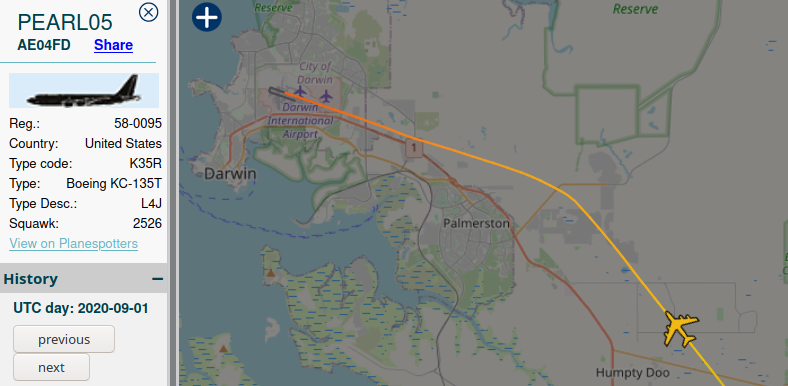
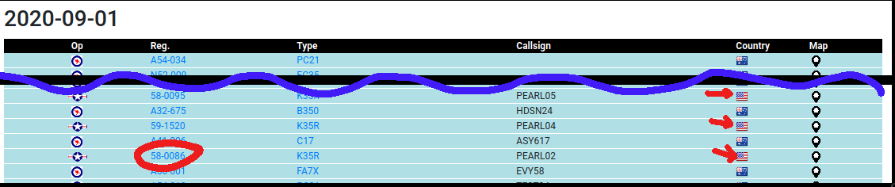
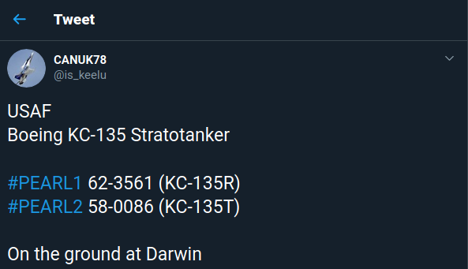

# I think this one is really going to take off
**Catagory:** OSINT  
**Difficulty:** Easy  
> You'll never believe it but I swear I saw one of those big American refueling planes flying around right over the boxing croc on the first of September. If only I knew its registration number... I bet I'd be able to find out all kinds of information, like the day it first flew.
> 
> The flag will be the date of the first flight of the plane I saw in this format: DUCTF{DD-MM-YY}

# Starting point

Let's first take a look at all of the information we're given. The following things seem important:

### The boxing croc
Googling for `boxing croc australia` reveals a 13 meter tall crocodile statue, located in a town called `Humpty Doo`.  This town is fairly close to Darwin International Airport, so it is likely the plane landed or took off from there.  

### The first of September
We're given a specific date, 2020-09-01. This should help us track down flight records.

### "One of those big American refueling planes"

Let's start figuring out which aircraft model this could be.  
A search for "us airforce refuelling plane" returns two predominant results:
* The KC-46 Pegasus
* The KC-135 Stratotanker  


If read a bit further on the wiki page, we find the following line:
> In February 2011, the [KC-46] was selected [...] to replace older Boeing KC-135 Stratotankers. The first aircraft was delivered to the Air Force _in January 2019_.  
  
For now, let's assume that our friend saw the KC-135 as they've been around for a lot longer and are likely more prevalent.  
 
# Plane tracking

Quick warning, I kinda fell down a rabbit hole here. There is a much simpler solution that doesn't require you to link data from three different sources together. Feel free to skip ahead to [Post Mortem](#post-mortem) for the "intended" solution.  


## Finding a tracker
Now that we have a model number, location, and a date we can start to track the plane. This is a bit problematic, as all of the well-known flight trackers charge (a lot of) money for access to historical data.  

Luckily I found one tracker that had some free access to historical data:  
https://www.adsbexchange.com/flight-data-sql-archive/  
The catch is that it only allows for direct queries:
> Limited history traces are available on a _per aircraft basis_ in the new web ui. 
  
So we will need to find a registration number first. Afterwards we can verify this number with adsbexchange.

## Finding registration numbers

To find candidate airplanes, we need a list of all active KC-135's.
After some researching, I stumbled upon the following site: https://www.radarbox.com/data/aircraft/K35R   
This list contains the historical locations for all KC-135's (aka K35R). Sadly, this site only allows free users to view 7 days of historical records, which is not quite enough to find out where all KC-135's were on 2020-09-01.  
  
However, we _can_ use this data to make a list of candidate planes that were near Australia after 2020-09-12. If we look for all planes near pacific airbases, we get the following candidates:  

| Day | From                | To                   | Identifier |
|-----|---------------------|----------------------|------------|
| 16th| Guam, USA           | Fussa, Japan         | 62-3566    |
| 15th| Naha, Japan         | ?, Japan             | 58-0055    |
| 14th| Guam, USA           | Basco, Philippines   | 58-0095    |
| 14th| Itbayat Philippines | Itbayat, Philippenes | 58-0086    |
  
Now we can just enter these plane identifiers, along with the date (2020-0901) in adsbexchange.com to see their flight path. We find that both `58-0095` and `58-0086` flew over the boxing croc.



## Registration info
Now that we have the plane's identifiers, we can use [an online tool](https://www.planelogger.com) to lookup the first flight date.  

| Plane   | First Flight | 
|---------|--------------|
| 58-0095 | 11.8.1959    |
| 58-0086 | 16.7.1959    |

That leaves us with two flags to try. The correct flag turned out to be:
```
DUCTF{16-07-59}
```


# Post Mortem
When the CTF was over, some of the other competitors shared their solutions. Turns out there are two major ways to simplify tracking down the plane.  
  
## Use ads-b.nl
I tried to find a free military plane tracker, but only found paid sites. Turns out there is a free tracker that worked perfectly for this challenge.  

 You can set the search region to Australia and lookup all flights on the first of September.
  
Most aircraft on the list are Australian, so the USAF Stratotankers stick out like a sore thumb.

## Use social media
Turns out there were a bunch of aviation enthusiasts / plane spotters that identified and posted about these planes online. Searching twitter for "KC-135" or "Stratotanker" would have revealed this tweet:


